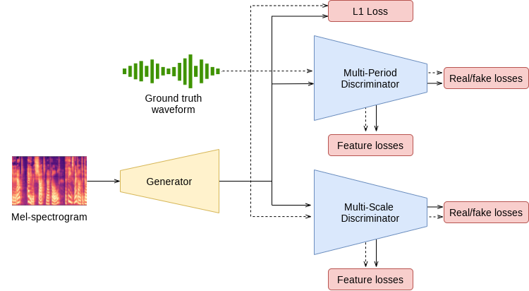

# (TTS) HiFi GAN Model: Mel - Spectrogram to Waveform
## Model Architecture
<a href="https://arxiv.org/pdf/2010.05646.pdf">Link Paper</a>



## Folder Structure
    assets                      # Assets Folder of README
    config.json                 # Configuration Training
    .gitignore
    processor.py                # Data Handler
    README.md
    requirements.txt
    hifi_gan.py                 # HiFi - GAN Model
    train.py                    # Training File
    trainer.py                  # Trainer for Model

## Setup Dataset
| Name    | Link |
| --------- | ------- |
| InfoRE Tech 16h     | https://huggingface.co/datasets/ntt123/infore/resolve/main/infore_16k_denoised.zip        |

## Setup Environment
```
git clone https://github.com/Alan-404/HiFi-GAN.git
cd HiFi-GAN
python3 -m venv venv
source venv/bin/activate
pip install -r requirements.txt
```

## Train Model
```
CUDA_VISIBLE_DEVICES={index} python3 train.py --device cuda --batch_size {train_batch_size} --val_batch_size {val_batch_size} --num_epochs {number_of_epochs}
```